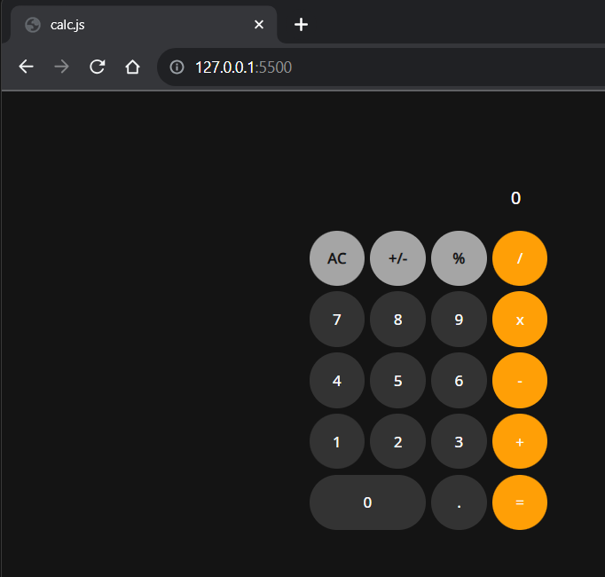

# Calculadora-em-JS

 

Calculadora iOS em JavaScript
Este é um projeto de uma calculadora desenvolvida em JavaScript que simula a aparência e funcionalidade da calculadora do iPhone. É uma calculadora simples, que permite executar operações matemáticas básicas.

Demonstração
Antes de começar a usar a calculadora, você pode conferir uma demonstração ao vivo aqui.

Como usar
Clone este repositório ou baixe o código-fonte como um arquivo ZIP.
Abra o arquivo index.html em um navegador da web.
Use o teclado virtual para inserir números e operadores.
Clique no botão "C" para limpar a tela.
Clique no botão "=" para calcular o resultado da expressão matemática.

Estrutura do Projeto
O projeto é composto por três arquivos principais:

index.html: A página HTML que contém a calculadora e o teclado virtual.
style.css: O arquivo CSS que estiliza a calculadora.
script.js: O arquivo JavaScript que controla a lógica da calculadora.

Customização
Você pode personalizar a aparência da calculadora e adicionar novos recursos, como funções trigonométricas, raiz quadrada, entre outros. Basta editar o arquivo script.js e o arquivo style.css de acordo com suas necessidades.

Contribuições
Se você deseja contribuir para este projeto, sinta-se à vontade para criar uma fork deste repositório, fazer as modificações desejadas e enviar um pull request. 
